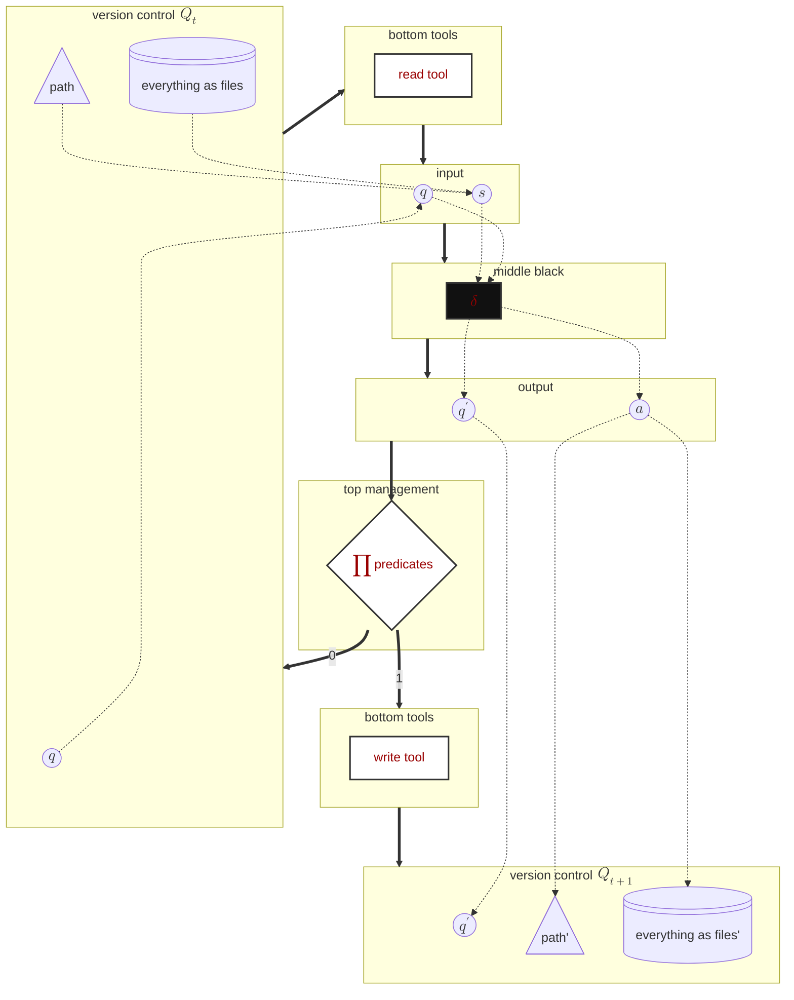

# Turingos 宪法

# 反奥利奥架构的反奥利奥架构

> 本章是前面三章的集大成者。建议读者首先复习以下内容：
>
> 1. [群体智慧的架构：⚪⚫⚪ 反奥利奥理论](https://www.notion.so/27c832a5282a80b08423e43db60b6f2c?pvs=21)
> 2. [用图灵机哲学做出一个能通过长周期图灵测试的 AI](https://www.notion.so/AI-30e832a5282a80478737ee0857ded73a?pvs=21)
> 3. [验证的非对称性：弱者能不能监管强者？](https://www.notion.so/16f832a5282a80db8026db3e7fc54118?pvs=21)

---

在由无数 ⚫ 中层黑盒（Agent 个体）组成的复杂生态中，顶层白盒绝不能是一个试图微观操纵（micromanagement）一切的"全知独裁者"。

相反，它的职责应当是冷酷、透明且机械的。它的核心任务可以被精炼为：**对系统信息进行管理**。更具体地说，就是对信号进行：

- 量化（quantization）
- 广播（broadcasting）
- 屏蔽（shielding）

当 Agent 的代码吞吐量远超人类时，人类工程师的核心价值不再是"写代码"，而是进入"管理层"，去**设计让 Agent 可靠工作的环境**。这个环境的质量，决定了整个系统能力的上限。

因此，顶层白盒必须通过以下三个维度的信号工程，来构建这个环境。

---

# 〇、图灵机原教旨 [Art. 0]

> **A person provided with paper, pencil, rubber, and subject to strict discipline, is in effect a universal machine.**
>
> 一个被提供了纸、铅笔、橡皮，并受到严格纪律约束的人，本质上就是一台通用机器。
>
> ——阿兰·图灵 (1912-1954)

TuringOS 不是"用 Turing 哲学启发的系统"，TuringOS 是**真的**通用机器。本章是 Art. I-V 一切论证之下的物理底层公理：所有后续论述若与本章冲突，本章为准。

---

## 0.1 四要素映射 [Art. 0.1]

| Turing 1948 | TuringOS 对应 | 实现锚点 |
|---|---|---|
| **Paper** (纸) | `tape_t` (Q_t = ⟨q_t, HEAD_t, **tape_t**⟩ 的物理底物) | `src/ledger.rs::Tape` |
| **Pencil** (铅笔) | wtool — `bus.append()`, append-only 写入 | `src/bus.rs::append_internal` |
| **Rubber** (橡皮) | append-only 不变量；失败提案进入 tape 时携带 `verified=false`；只在 ∏p=1 时 Q_{t+1}=wtool(output)，∏p=0 时 Q_{t+1}=Q_t | `src/ledger.rs::Tape` doc-comment "NEVER modified or removed" |
| **Strict discipline** | 谓词 Π_p (Art. I.1) + Veto-AI (Art. V.1.3) + 本宪法 | `src/bus.rs::forbidden_patterns` + Veto-AI 流程 |

四要素任何一者缺失或失职，TuringOS 即沦为"近似图灵机"——结构在，普适性破产。

---

## 0.2 Tape Canonical 公理 [Art. 0.2]

> **所有信号必须可从 tape 重建。**

这是 Turing 1948 定义的直接逻辑后承：如果 paper 不携带产生当前状态所需的全部信号，那"a person with paper"就不能复算到那个状态——universal machine 性质破产。

**操作含义**：

1. 任意 cost / time / provenance / market price / wallet state / rejection feedback / search history / boltzmann routing / mr tick，frozen tape 上必有充分信息可推导
2. 平行账本（`RunCostAccumulator` / `WalletTool` / `search_cache` / `LibrarianTool` / `bus.graveyard` / FC trace 等）只能是 tape 的**派生视图**，不可作独立 source of truth；每个派生视图都必须有 `assert_eq!(view, derive_from_tape(tape))` 守恒测试
3. Phase E heldout sealed eval 的可重现性 = frozen tape 完全 reconstructible（PREREG § 1.8 的物理基础）；任何不能从 tape 重建的字段都不可进入 PputResult 主指标
4. Phase D ArchitectAI 必须从 tape 上 attribute per-node cost/provenance 到 golden path——否则"compile capability"步骤无信号可读
5. 失败分支（vetoed / parse-fail / Lean-rejected）必须以 `kind=AgentProposal, verified=false, reject_class=...` Node 形态进入 tape——失败也是状态；Phase B 之前在 `bus.graveyard: HashMap` 中的设计是 anti-pattern
6. WAL 持久化是 Phase E 强制项（不可 opt-in），且 WAL 必须有 per-line SHA-256 hash chain（无 hash chain → tampering 不可检测）

**已知违反点**（2026-04-26 双 auditor 审计；canonical inventory 见 `handover/architect-insights/TAPE_CANONICAL_AUDIT_2026-04-26_AUDITOR.md` 24 处违反 + `_CODEX.md` 独立验证收敛于同样诊断）：

| 类别 | 代表例 | 受限文件 |
|---|---|---|
| **dormant_tape_field** | `Node.completion_tokens` 字段定义但生产 hardcode=0 (`src/bus.rs:268`) | bus.rs / kernel.rs / ledger.rs (STEP_B) |
| **parallel_ledger** | `RunCostAccumulator` / `WalletTool` / `bus.graveyard` / `search_cache` / Librarian board / FC trace | 8+ 模块 |
| **missing_provenance** | Boltzmann routing / mr tick / `EventType::MarketCreate`+`MarketResolve` 定义但永不 emit / Lean error string drop | bus.rs / kernel.rs / evaluator.rs |
| **reproducibility_break** | WAL opt-in / no per-line hash chain / payload-byte hack 替 token / 失败分支不上 tape | wal.rs / evaluator.rs |
| **hack_proxy** | `tape_tokens = Σ payload.len()` (字节数当 token，category error) | evaluator.rs |
| **blockchain_reservation_gap** | Node 无 `hash` 字段；mr tick 应上 tape 但只到 stderr | ledger.rs / evaluator.rs |

**修复义务**（强制；本宪法颁布后任何 Phase C+ batch 必须先满足）：

10-commit 原子化方案（详见 audit doc § "Recommended Atomization"）：

| Commit | 内容 | 关闭违反 |
|---|---|---|
| 1 | Tape schema upgrade — Node.cost 结构化 + Node.kind enum + WAL v2 hash chain | V-01, V-06, V-18 |
| 2 | RunCostAccumulator → derived view + cross-validation | V-02, V-03, V-22 |
| 3 | MarketCreate / MarketResolve / 结构化 Invest 上 tape | V-04, V-05, V-15, V-16 |
| 4 | 失败提案以 verified=false 进 tape；删 graveyard | V-03, V-09, V-13 |
| 5 | 强制 WAL + mr tick 上 tape | V-08a, V-17 |
| 6 | Synthetic short-circuit 上 tape | V-07 |
| 7 | Boltzmann pick + LLM call 各成 tape Node | V-08b, V-22 |
| 8 | search/board/wallet sidecar 降级为 derived projection | V-10, V-11, V-14 |
| 9 | Lean error string + Halt detail 上 tape | V-19, V-21 |
| 10 | WAL hash chain + audit guard provenance | V-18, V-24 |

Phase C C2 batch 重启 gating 在 Commit 1-4 完成（不 wait 全 10 个；其余可并行 Phase D）。

---

## 0.3 区块链化保留 [Art. 0.3]

未来 tape 完整性升级路径（Phase E+，本宪法预留语义槽位）：

- `Node` 增加 `hash: [u8; 32]` 字段（sha256 of `payload + author + citations + completion_tokens + parent_hashes + kind + kind_payload`）
- `bus.append` 计算并落入 hash
- Boot 时验证整链 (Merkle 树式)；任一节点篡改 → boot panic
- WAL v2 (Commit 1) 已有 per-line hash chain；Phase E 加 Merkle root + heldout_sealed_hash 双锁

当前阶段（Phase C/D）不强制 hash 链，但**Node 字段命名 + bus.append 签名必须为此预留扩展空间**。下一次构造性 amendment 是 Phase E gate 必经。

> **重要 caveat**（2026-04-26 audit 后补）：本节描述的"hash chain 自实现"是**路径 A 范畴**（见 Art. 0.4）。如选择路径 B（真 git substrate），git 的 SHA-1/SHA-256 commit hash + content-addressable objects 已 30 年成熟实现该机制，本节自实现描述可作废。

---

## 0.4 Q_t 是 version-controlled 状态 [Art. 0.4]

宪法 Art. IV 流程图（lines 540-610）明确规定 Q_t = ⟨q_t, HEAD_t, tape_t⟩ 是 **"version control"** 三元组：

- `q_t`：内部状态（agent cognitive state）
- `HEAD_t`：**as path** — 路径指针（git HEAD-style）
- `tape_t`：**as files** — 文件内容（git working tree-style）

且 `rtool(⟨q_t, tape_t, HEAD_t⟩)` 与 `wtool(output | tape_t, HEAD_t, tools_other)` 显式以三元组为输入/输出（lines 556 + 584）。

**当前实现 gap**（2026-04-26 ultrathink audit 在 Art. 0 base 修订后立即发现，超出 Art. 0.2 的 24 处违反，是更深的根本性 gap）：

| 宪法元素 | 应有实现 | 当前实现 | gap |
|---|---|---|---|
| `q_t` | 显式序列化 | 散在 `RunCostAccumulator` + bus state | ❌ |
| `HEAD_t` | git HEAD ref / path pointer | **完全未实现**（runtime 0 处 path pointer 概念）| ❌❌❌ |
| `tape_t` | git working tree | `Vec<Node>` in-memory | partial |
| `rtool(q, tape, HEAD)` | git checkout/diff | `bus.snapshot()` 简化接口，无 HEAD axis | ❌ |
| `wtool(output \| ...)` | git commit | `bus.append()` 不操作 path | ❌ |

**Runtime grep 验证**：`grep -rE "Repository::|git2::|libgit2|Command git" src/ experiments/minif2f_v4/src/` → **0 hits**。整个项目 runtime 一行 git 都没用。`build_sha` 字段仅 build-time 编译产物 SHA，**不是宪法的 HEAD_t**。

**实现路径（pending architectural decision）**：

| 路径 | 工作量 | 宪法对齐度 | 说明 |
|---|---|---|---|
| **A. 语义版** | ~3 周 | partial | 保持 `Vec<Node>`；加 `hash: [u8;32]` (Art. 0.3) + `HEAD_t: NodeId` last-accepted pointer + `rtool/wtool` 显式三元组签名。满足 version-control **形式语义** 但不用 git 库 |
| **B. 真 git 版** | ~6-8 周 | full | libgit2/git2-rs 集成；每 cell run 用 runtime 临时 git repo；Node = commit object；`bus.append` = `git commit`；`HEAD_t` = git HEAD ref；`Π_p` = pre-commit hook；Boltzmann routing = git branch；自动获得 git 30 年成熟的 hash chain + immutable objects + branch + reflog + content-addressable storage + Merkle DAG |
| **C. 延期版** (hybrid) | ~3 周 现 + 5 周 后 | full @ Phase E | Phase C/D 用 A 快速 unblock；Art. 0.4 此条款 declares B 为 Phase E gate 必经；Phase E 切换 substrate |

**Phase E reproducibility 影响**：
- 路径 A：自定义 hash chain 永远不会比 git 更鲁棒；Phase E 审计者需用项目自定义工具验证；调试 `git log` 等工具不可用
- 路径 B：标准 `git verify-pack` / `git fsck` / `git archive --format=tar HEAD | sha256sum` 直接审计；30 年 battle-tested；Phase D ArchitectAI 可用 `git diff` 等工具做 cost attribution
- 路径 C：技术债显式延期；Phase E 迁移成本一次性付清

**当前决策状态**：**未决 (pending)**。本宪法颁布后下一次架构 commit（Commit 1: Tape Schema Upgrade，见 Art. 0.2 修复义务）必须明文标注采用 A/B/C 中哪条路径。**Phase E gate 强制 B**（除非 Phase E 之前用户 sudo 修宪降低 fidelity 要求）。

> **审计责任**：Art. 0.4 的发现暴露了 Art. 0.1-0.3 起草时的盲点（auditor + codex 顺着初始 framing 假设 "tape = Vec<Node>"）。Art. 0.4 是 ArchitectAI 在用户提示后的二级深挖，体现 Art. V "Go Meta：架构的架构" 精神。下次 ArchitectAI 提案任何 tape 相关修订必须先回溯 Art. 0.4 路径选择。

---

## Laws (基本法)

> **解释关系**：Laws 描述 token 经济学（Coin/YES/NO）；Art. 0 描述图灵物理底层（tape）。Coin 是 tape 上特定 node payload 形态；Laws 实施依赖 Art. 0 提供的 append-only canonical ledger。Commit 3 (Art. 0.2) 后，wallet/market 状态成为 tape 的派生视图 → Laws 与 Art. 0 完全 align。

- **Law 1: Information is Free** — Agent 搜索与查看零成本，思考不花钱
- **Law 2: Only Investment Costs Money** — 1 Coin = 1 YES + 1 NO (CTF 守恒)；on_init 是唯一合法铸币点


# 一、信号的量化 [Art. I]

在反奥利奥架构中，顶层白盒的首要任务，是对中层黑盒的输出进行**有损压缩**。

中层黑盒的每一次推理、每一次试错，其内部状态都是高维且充满噪声的。如果顶层试图理解这些高维状态，它自身也会不可避免地退化为黑盒。因此，顶层必须通过严密的形式化规则，把复杂的行为结果压缩为**确定性的低维标量**。

这种量化过程拒绝任何主观估值与解释，只依赖：

- 客观的物理结果
- 确定性的逻辑校验

---

## 1.1 布尔信号 [Art. I.1]

> ### 什么是"谓词"（Predicate）？
>
> 在逻辑学和计算机科学中，谓词本质上就是一个"只做判断题的机器"。
> 你给它一个或多个输入，它经过确定的规则运算后，永远只会输出两个结果之一：
>
> - 真（$1$）
> - 假（$0$）
>
> $$
> f: X \to \{0,1\}
> $$
>
> 例如，在"苹果是红色的"这句话里，"是红色的"就是谓词，它用于描述主语（苹果）的客观属性。
>
> 在逻辑世界中，谓词剥离了所有文学色彩，变成了极其冷酷的判定规则。
>
> 你可以把它想象成工厂流水线上的一个严格质检卡口：
>
> - 如果传送带上的苹果是红色的，则输出 $1$（放行）
> - 如果苹果未成熟、不是红色，则输出 $0$（拦截）

直白地说，布尔信号就是：**有没有通过验证**。

搭建布尔信号的本质，是要求人类把模糊的主观意图，转化为机器能够严格执行和验证的**状态谓词集合（set of state predicates）**。

它是非黑即白的 $0/1$，通常用于确立系统的绝对边界条件。

在真实世界的工程实践中，我们必须认清一个严酷事实：

> 自然语言约束（例如在提示词中写"请遵守架构规范"）只是软约束，永远存在漏网概率。

因此，顶层白盒不能依赖语言（另一个黑盒）去约束黑盒，而必须把约束转化为机器可执行的**硬约束**，例如：

- 自定义 Linter 检查
- CI（持续集成）测试
- 结构化数据校验

无论黑盒内部概率分布如何，顶层只看它是否违规：**非黑即白，只有 0 或 1**。

---

### 工程现实中的妥协：PCP 谓词与"疑罪从无" [Art. I.1.1]

前文讨论的主要是针对先验知识的完美谓词，例如：

- 数学计算
- 人造游戏
- 代码语法合法性

但在实际工程中，尤其在处理复杂后验问题时，例如：

- UI 布局是否合理
- 自然语言回复是否礼貌
- 开放环境中的视觉识别

我们往往无法写出一个 $100\%$ 完美的谓词函数。

当完美谓词不可得时，顶层白盒的约束机制就必须退化为 **PCP 谓词**。

这种机制在工程实现上遵循一种类似"疑罪从无"的非对称验证原则：

1. **绝对不误杀（Completeness = 1）**
   如果中层黑盒（Agent）给出的候选解确实正确，谓词必须始终接受（输出 $1$）。

2. **高概率拦截（Soundness error 极小）**
   如果候选解是错误的，谓词不必做到全知全能地识别所有错误，但必须以极高概率拒绝（输出 $0$）。

在反奥利奥架构中，这种退化不仅可以接受，而且是系统能够处理复杂现实问题的关键。

因为中层黑盒本身具有极高的生成吞吐量，会进行高频试错。只要顶层的 PCP 谓词满足：

- 正确解绝对能够存活
- 错误解很难连续蒙混过关

那么即便偶尔有漏网之鱼，系统在宏观统计演化上仍会坚定收敛到最优解。

这正是工程学中"用概率换取系统可行性"的经典智慧。

---

要做到绝对的"疑罪从无"，也就意味着所有谓词都必须成为系统的 **Ground Truth**，并且以代码的形式显式存在。

> 参考：
> [瓶颈定理：关于世界（world）与基准真相（Ground Truth）](https://www.notion.so/world-Ground-Truth-1a3832a5282a8098adf6d53baa29e44c?pvs=21)

---

## 1.2 统计信号 [Art. I.2]

当候选解通过了布尔信号的底线验证后，顶层白盒还需要进一步衡量它的**相对有效性**。这就引入了连续的统计信号，通常定义在区间：

$$
[0,\infty)
$$

统计信号的本质是：顶层白盒使用**确定性的统计算法**，把中层黑盒群体产生的海量、复杂、充满噪声的数据，压缩成简洁的连续标量。

顶层此时并不"审阅"，而是直接运行统计算法。例如：

- **共识提取（众数 / 中位数）**
  当多个 Agent 针对同一问题独立给出不同答案时，顶层通过计算众数或中位数，机械地剥离极端的"幻觉"偏差，提取群体共识。

- **信誉累积（计数器）**
  统计某个 Agent 提出的方案在后续流程中被其他 Agent 成功调用的总次数。这个数字越大，该 Agent 在系统中的权重信号就越强。

- **效用评分（期望 / 方差）**
  顶层白盒无需理解 AI 是如何写诗或编程的。它只需要在 AI 工作环境中布满观测工具，然后用严谨的数学公式（例如求平均、求方差）计算一份"体检报告"。再用这份纯客观、不可造假的体检报告，决定：
  - 给哪些 AI 升职加薪
  - 把哪些 AI 淘汰出局

在整个过程中，统计算法本身没有任何"智能"（即绝对白盒），但却极其有效。

通过大数定律，微观个体层面的随机幻觉和偶然失误会被统计学抵消。无论中层黑盒的推理过程多么不可解释，宏观层面最终都会涌现出一个稳定、客观、可比较的信号。

这类信号为系统后续的演化与资源分配提供了极其明确的指引。

> 市场经济中的价格，就是最典型的统计信号。
> 顶层机制并不关心某个具体个体为何出价，它只客观记录成千上万次交易交汇点所形成的数值。

---

# 二、信号的选择性广播 [Art. II]

量化后的信号如果只停留在顶层，系统依然会是一盘散沙。

管理的核心在于：**引导群体的演化方向**。而这依赖于顶层白盒把信号有效广播给中层个体。

但是，从信息论视角看，无差别的全量广播会导致严重的通信过载。因此，高效的反奥利奥架构必须执行**选择性广播**。

---

## 2.1 广播典型错误 [Art. II.1]

在庞大的黑盒集群中，无差别试错的成本极其高昂。

当某个黑盒触发了底层布尔硬约束时，顶层白盒首先会瞬间向该个体精准注入包含修复指引的错误信息（error message），引导其自我纠错。

但这还不够。

如果顶层发现多个 Agent 都在同一个地方跌倒，也就是出现所谓的"典型错误"，那么顶层机制就应当：

1. 将这类典型错误抽象出来
2. 更新全局架构文档
3. 再把抽象后的规则广播给所有 Agent

需要特别强调的是：

> 顶层白盒绝不能把具体报错日志群发给所有人。
> 那会造成灾难性的上下文污染。

这种把个体失败经验转化为全局规则的广播，本质上是在给整个群体搜索空间做剪枝。这样可以避免大量算力继续浪费在已经被证明无效的路径上。

---

## 2.2 广播价格信号 [Art. II.2]

价格信号的广播，是驱动群体产生正向涌现的引擎。

在复杂任务中，总有一些子目标或特定资源的价值远高于其他部分。顶层白盒通过广播高权重的标价，例如：

- 悬赏特定任务实现
- 对紧缺资源标出高价

以此引导黑盒的注意力分布。

这种广播不对黑盒指手画脚，也不提供解决问题的具体步骤。它只广播信号，仅此而已。

黑盒个体在接收到这些高价值信号后，会自发调整行为倾向，把更多生成能力倾注到系统最需要的地方。

---

### 探索（Exploration）与利用（Exploitation） [Art. II.2.1]

在广播价格信号的动态过程中，系统必须在**探索**与**利用**之间维持精妙平衡。

- 如果中层黑盒对最高分信号过度敏感（过度利用），所有中层黑盒会迅速收敛到同一个局部最优，导致群体失去多样性，甚至陷入集体平庸。
- 如果中层黑盒对价格信号过度不敏感（过度探索），则相当于信号根本没有发挥作用。

因此，价格广播机制必须既能引导方向，又不能抹杀群体异质性。

---

# 三、信号的选择性屏蔽 [Art. III]

在复杂网络中，信息过载同样是灾难的开始。

中层黑盒的本质决定了它们不仅会产生奇思妙想，也会产生幻觉。因此，顶层白盒必须像物理上的绝缘层一样，执行冷酷的**信号屏蔽**，防止局部错误引发系统性的级联雪崩。

---

## 3.1 屏蔽错误 [Art. III.1]

由于黑盒个体在推理时会从当前上下文中进行模式学习（in-context learning），它们无法分辨：

- "历史遗留的错误模式"
- "精心设计的正确模式"

一个坏模式一旦污染上下文，就会被后续所有 Agent 当作"正确示例"学习。时间越长，坏模式出现频率越高，传播速度越快。这正是**技术债漂移**的根源。

因此，屏蔽错误不仅意味着在运行时切断个体错误输出，还意味着必须在宏观架构上建立持续的垃圾回收机制。

顶层白盒需要像清理内存一样，部署后台"园丁 Agent"，定期扫描并屏蔽那些偏离黄金原则的陈旧代码与过期文档，确保系统熵值不会随时间失控。

---

## 3.2 封装细节 [Art. III.2]

对于黑盒而言，Context 是零和资源：

> 注入的信息越多，每个 token 的相对注意力权重就越低。

如果顶层白盒试图把所有系统规则写成"一个巨大文档"，并一次性塞给每一个个体，那么关键约束信号就会被淹没在大量规则中，导致黑盒行为发生不可预测的漂移。

因此，顶层白盒必须执行严格的**细节封装**与**渐进式披露**。

它不应该提供一本百科全书，而应该提供"百科全书的目录接口"。

让 Agent 按需加载特定文档，可以避免上下文被无关信息污染。通过屏蔽无关细节，顶层才能确保黑盒有限注意力聚焦在当前任务刀刃上。

---

## 3.3 屏蔽相关性 [Art. III.3]

群体智慧的一个基本定理是：

> 只有当个体样本相互独立时，群体统计信号才具有收敛的数学意义。

如果所有黑盒共享完全相同的实时上下文和中间状态，那么它们的输出会高度相关，最终导致：

> 一万个黑盒的智慧，退化为一个黑盒的智慧。

因此，顶层白盒必须刻意屏蔽个体之间的横向相关性。通过隔离信息源，顶层强制维持群体异质性，从而保证群体智慧在面对未知问题时的广度，使得同一问题能够从不同角度被审视。

---

## 3.4 屏蔽 Goodhart 问题 [Art. III.4]

管理学与经济学中有一个著名的古德哈特定律（Goodhart's Law）：

> 当一个度量成为目标时，它就不再是一个好的度量。

由于中层黑盒具有强大的模式匹配与概率优化能力，如果它们能够完全窥探顶层白盒的打分算法细节，它们必然会放弃解决实际问题，而转向生成专门骗取高分的讨巧输出。

为了彻底屏蔽这个问题，顶层白盒的验证机制必须对黑盒保密。

顶层应当把具体度量逻辑写在中层无访问权限的区域。黑盒只能通过持续试错来感受错误信息（error message），而不能把度量函数本身作为优化捷径。

---

> "When something failed, the fix was almost never 'try harder.' The fix was always: 'what capability is missing, and how do we make it both legible and enforceable for the agent?'"
>
> "当某个环节失败时，修复方案几乎从来不是'再努力一点'。修复方案永远是：系统缺失了什么能力，我们如何让这种能力对 Agent 既清晰可见，又可被强制执行？" [1]
>
> —— Ryan Lopopolo, OpenAI 技术成员

在这套基于信号的管理体系下，人类工程师的角色发生了根本性转变。

我们不再要求黑盒个体在自然语言软约束下奇迹般不犯错，因为要求一个概率生成模型"更加努力"本身就是一个伪命题。

正如 OpenAI 工程报告 [1] 最终得出的深刻结论：

> "Building software still demands discipline, but the discipline shows up more in the scaffolding rather than the code."

软件工程的本质没有改变，但纪律性更多体现在**脚手架（scaffolding）**上，而不是代码本身。

真正的管理者，应当把自身对架构的品味与直觉，显式编码为机器可执行的：

- 工具（tools）
- 抽象（abstractions）
- 反馈循环（feedback loops）

通过极其克制但绝对确定的信号量化、广播与屏蔽，我们才能在秩序与混乱的交界处，建立起强大的顶层白盒，让群体智慧得以在其中生生不息。

---

**抓着自己的靴带把自己提起来**



---

# 四、Boot：抓着自己的靴带把自己提起来 [Art. IV]

计算机启动之所以叫 **boot**，其实来自一个古老的英语表达：

**pull oneself up by one's bootstraps**

字面意思是"抓着自己的靴带把自己提起来"。

在现实世界中，这是不可能做到的事，因为一个人如果完全没有外力，就不可能把自己从地上拎起来。但计算机系统却恰好必须完成一件看起来同样矛盾的事：

> 在刚通电的那一刻，机器几乎什么都没有，却必须自己把整个系统启动起来。
> 

当电源刚接通时，机器并不存在操作系统，也没有任何运行中的程序。唯一存在的，是一段极小、极简单的初始化程序。

它的任务不是解决复杂问题，而只是完成几件最基础的事：

1. 读取下一段程序
2. 检查它是否符合规则
3. 把控制权交给它

下一层程序再继续加载更复杂的部分，如此一层一层向上扩展，最终整个系统被逐步"拉起来"。这就是 **boot** 这个词真正描述的过程。

从本章架构来看，这个过程其实就是 **Initialization** 阶段所做的事情。

大总管系统（黑盒）首先接收人类架构师提供的规范，然后将这些规范编译成机器可执行的谓词规则，并写入顶层白盒。同时，系统还会初始化第一份世界状态 $Q_0$，并准备好最基本的工具，例如：

- 读取工具（read tool）
- 写入工具（write tool）

当这些条件准备完成之后，系统才第一次进入后续运行循环。

---

> **Boot = 初始化顶层白盒规则 + 初始世界状态**
> 

> 
> 

> Boot 的本质，是把人类规范（spec）编译成机器谓词（predicates），并写入系统的信任根，从而允许黑盒 Agent 在验证约束下持续演化世界状态。
> 

---

这一步只发生一次，却决定了整个系统之后的行为方式。

因为在初始化完成后，系统演化将不再依赖人类持续干预，而是完全由顶层白盒的验证规则所约束。中层黑盒可以不断提出新的候选状态，但只有通过谓词验证的结果才能真正写入世界状态。

换句话说，一旦系统被"拉起来"，它就会在既定规则下自行运行。

因此，"boot"并不是一个随意命名，它描述的正是这样一个过程：

> **一个极小的初始化结构，通过逐层加载与验证，把一个原本空白的机器状态，逐步提升为一个能够持续运行的计算世界。**
> 

一旦这个过程完成，系统就不再需要被"提起来"第二次。它已经能够依靠自己的结构继续向前运行。

    flowchart TD
        classDef white fill:#fff,stroke:#333,stroke-width:2px,color:#900
        classDef black fill:#111,stroke:#333,stroke-width:2px,color:#900
        classDef human fill:#fff4e6,stroke:#a85d00,stroke-width:2px,color:#5c3200
        classDef note fill:#fff8cc,stroke:#8a6d00,stroke-width:1px,color:#4d3d00
    
        subgraph Initialization
            human:::human@{ shape: sl-rect, label: "human architect provides spec" }
            law:::white@{ shape: docs, label: "(tentative) ground truth" }
            initAI[Init AI]:::black
        end
    
        subgraph Finalization
            halt@{ shape: dbl-circ, label: "HALT" }
        end
    
        subgraph Q0["version control: $$Q_t = \langle q_t,\ HEAD_t,\ tape_t \rangle$$"]
            q0(("$$q_t$$"))
            HEAD0@{ shape: tri, label: "$$HEAD_t$$<br>as path" }
            tape0@{ shape: lin-cyl, label: "$$tape_t$$<br>as files" }
        end
    
        subgraph Q1["version control: $$Q_{t+1} = \langle q_{t+1},\ HEAD_{t+1},\ tape_{t+1}\rangle$$"]
            q1(("$$q_{t+1}$$"))
            HEAD1@{ shape: tri, label: "$$HEAD_{t+1}$$<br>as path" }
            tape1@{ shape: lin-cyl, label: "$$tape_{t+1}$$<br>as files" }
        end
    
        subgraph rtool["bottom tools: $$\langle q_i,\ s_i \rangle = \mathbf{rtool}(\langle q_t,\ tape_t,\ HEAD_t \rangle)$$"]
            r["read tool"]:::white
        end
    
        subgraph input["$$input = \langle q_i,\ s_i \rangle$$"]
            qi(("$$q_i$$"))
            si(("$$s_i$$"))
        end
    
        subgraph AI["middle black: $$output = \delta(input)$$"]
            delta["AI as $$\delta$$"]:::black
        end
    
        subgraph output["$$output = \langle q_o,\ a_o \rangle$$"]
            qo(("$$q_o$$"))
            ao(("$$a_o$$"))
        end
    
        subgraph top["top management: $$\prod \mathbf{p}(output \mid Q_t)$$"]
            predicates:::white@{ shape: processes, label: "predicates $$p$$" }
            p{"$$\prod \mathbf{p}$$"}:::white
        end
    
        subgraph toptick["top management: ticks"]
            mr["map reduce"]:::white
            clock(("clock")):::white
        end
    
        subgraph wtool["bottom tools: $$\mathbf{wtool}(output \mid tape_t,HEAD_t,tools_{other})$$"]
            w["write tool"]:::white
            tools["other tools"]:::white
        end
    
    %% init
        human --x|once| law
        law --> initAI
        initAI --x|once| predicates
        predicates --- p
        initAI --x|once| mr
        initAI --x|once| Q0
    
    %% loop
        tape0 & HEAD0 ----> si
        q0 --> qi
        qi & si --> delta
        delta --> qo & ao
    
        qo -.-> q1
        ao -.-> HEAD1
        ao -.-> tape1
    
    %% macro
        Q0 ==> rtool ==> input ==> AI ==> output ==> p
        p ==>|"$$Q_{t+1} = \mathbf{wtool}(output)$$<br>if $$\prod \mathbf{p} = 1$$"| wtool ==> Q1
        p ==>|"$$Q_{t+1} = Q_t$$<br>if $$\prod \mathbf{p} = 0$$"| Q0
        q1 ==>|"if q = halt"| halt
    
    %% map reduce
        clock --> mr
        mr ==>|map| tape0
        mr ==>|reduce| tape1
    ```

---

# 五、Go Meta：架构的架构 [Art. V]

所谓元智慧（meta-intelligence），就是"智慧的智慧"。同理，要让反奥利奥架构生生不息，我们就必须构建"元架构（meta-architecture）"——也就是**架构的架构** [2](#)。

在传统 Boot 过程中，InitAI 只是一个"高级翻译官"：

- 它负责把人类工程师编写的规范（spec）
- 机械地翻译成机器谓词（predicates）等白盒代码

但这里存在一个致命瓶颈：**人类工程师的认知瓶颈**。

当人类无法清晰描述复杂环境规则，或者人类编写的规范本身不够详细、甚至存在逻辑漏洞时，机械的 InitAI 只会把这些缺陷忠实地实例化到顶层白盒中。

这会导致整个系统显得机械而死板，系统能力上限也会被死死锁定在人类边界之内 [3](#)。

要打破这个天花板，系统必须掌握一种新的能力：

> **自己给自己搭架构。**
> 

所有过去的黑盒经验——包括试错与教训——都应当被提取并转化为反奥利奥架构中显式的白盒知识，例如：

- 更明确的提示词文本
- 更清晰的工具设计
- 更完备的验证代码

---

## 5.1 三权分立：元架构层的内部博弈 [Art. V.1]

为了让系统安全地实现自我进化，InitAI 不能是一个单一独裁的黑盒。它内部必须实现严格的"三权分立"机制。

系统演化的本质是：

- 机制
- 突变
- 选择

这恰恰对应元架构层中的三个角色及其永恒博弈。

### 1. 宪法（Constitution）——唯一的基准真相 [Art. V.1.1]

当人类工程师把设计工具、编写测试、搭建环境的权力全部下放给 AI 后，人类在系统中的位置退到了哪里？

答案是：

> **价值观与物理法则的确立者。**
> 

人类不再规定"系统应该怎么做"，而是规定"最顶层的目标与价值观"。这构成了整个系统的绝对底层根基。

> [2026-04-25 架构师补充] **sudo 权限的精确范围**：人类 sudo 权限**仅且只**作用于 `constitution.md` 本身。Trust Root 清单中的其他载荷文件（如 kernel.rs / lean4_oracle.rs / 预注册 / 评分管线 / cases/* 等）属于 ArchitectAI 的合法升级范围 —— 见 V.1.2。系统因此采用两层防御：(i) **提案时**由 Veto-AI 校核违宪与否（V.1.3）；(ii) **运行时**由 Boot 的 SHA-256 manifest 保证"实际加载的字节 == 已 commit 的字节"。这两层与本节的 sudo 形成**三段守护**：宪法 sudo（少数）+ Veto-AI 提案闸（多数）+ Boot 整合性闸（全部）。

---

### 2. ArchitectAI（架构师 AI）——提出者 [Art. V.1.2]

它是系统中的"激进改革派"。

当系统在运行中发现现有白盒存在缺陷时，例如：

- 工具（tools）不够用
- 当前顶层谓词（predicates）无法有效过滤新的幻觉

ArchitectAI 会主动分析系统日志，进而：

- 编写新的验证谓词函数
- 发明新的底层工具
- 重新设计文件系统（tape）的存储结构

它是系统熵减的引擎。

> [2026-04-25 架构师补充] **ArchitectAI 拥有架构升级的 commit 权限**，而非仅止于"提出"。任何**不涉及 `constitution.md`** 的修改 —— 包括 Trust Root 清单（`genesis_payload.toml`）本身的载荷条目增减与 SHA-256 重算 —— 经 Veto-AI（V.1.3）校核未发现违宪后，由 ArchitectAI 直接落盘并更新 manifest 对应字段。此过程**不需要人类 sudo**。理由：宪法已经是 ground truth，ArchitectAI 的修改若未违宪则属于宪法允许的演化空间；强制 sudo 反而把人类拉回工程细节，违反 V.1.1 "人类只立宪法"的 Meta 原则。

---

### 3. Veto-AI（违宪否决 AI）——验证者 [Art. V.1.3]

> [2026-04-25 架构师补充] 此前称 JudgeAI；本次重命名为 **Veto-AI**，以精确反映其唯一职责：单一的"违宪否决权"，无任何主观评判维度。命名变更已贯穿至下方 FC3 流程图节点 `vetoAI`。

它是系统中的"保守守门人"。

ArchitectAI 提出的任何架构变更，都**不能**直接上线。必须经过 Veto-AI 的冷酷审查。

Veto-AI 唯一的工作是：

> 拿着宪法，反复逐条校验 ArchitectAI 生成的新架构代码是否"违宪"。
> 

它**不**做（白名单严格排除）：

- 主观质量评价（代码可读性 / 工程口味）
- 性能或效率评判
- 测试覆盖率主观打分
- 任何与"违宪与否"**无关**的判定

它只做一件事：

> 否决违宪提案。
> 

也就是说，它只负责（偏）客观的违宪判定 —— 输出域 = `{PASS, VETO}` —— 不承担其他主观评价。任何把 Veto-AI 用于"代码评审"或"质量审计"的尝试都属于范畴越界，应由独立的非 Veto-AI 审计者承担。

---

> **Meta 的本质**
> 

> 
> 

> 在终极 Meta 形态中，人类架构师的唯一意义是：
> 

> 
> 

> **设立总架构的 Ground Truth——"宪法"。**
> 

> 
> 

> 这部宪法被存放在只读文件系统上，只有人类架构师才拥有修改它的 sudo 权限。
> 

---

## 5.2 宪法界限与示例 [Art. V.2]

下面给出一些可能的"宪法级"约束：

- 系统的总算力消耗不得超过 $10000$
- 必须在 24 小时内给出结果
- 任何状态变更必须具有可逆性（总是能够回滚到 $Q_{t-1}$）
- 核心谓词逻辑必须是确定性的，禁止引入概率模型
- ……

---

## 5.3 宪法修订日志 [Art. V.3]

> 宪法的修改唯一触发条件 = 人类架构师的显式 sudo 授权。每次修订必须在此处留痕，注明日期、变更摘要、动机，以便所有后续 ArchitectAI / Veto-AI / 审计者可独立复原"宪法在某时刻的形态"。

| 日期 | 触发者 | 章节 | 摘要 |
|---|---|---|---|
| 2026-04-25 | 人类架构师 | V.1.1 | 明确 sudo 权限**仅**作用于 `constitution.md` 本身；Trust Root 清单中其他文件归 ArchitectAI 升级范围；说明"sudo + Veto-AI + Boot manifest"三段守护结构。 |
| 2026-04-25 | 人类架构师 | V.1.2 | 明确 ArchitectAI 拥有 commit 权限（不止"提出"）；任何不动 `constitution.md` 的修改经 Veto-AI PASS 后由 ArchitectAI 直接落盘并更新 Trust Root manifest，无需人类 sudo。 |
| 2026-04-25 | 人类架构师 | V.1.3 + FC3 | JudgeAI 重命名为 **Veto-AI**；增加白名单严格排除（不做主观质量、性能、可读性评判）；FC3 流程图节点 `judgeAI` 同步重命名为 `vetoAI`。 |
| 2026-04-26 | 人类架构师 (gretjia) | **Art. 0 + 0.4 (新增, 同 amendment cycle)** | 新增"图灵机原教旨"作为 Art. I 之前的物理底层公理。**Art. 0** (Turing 1948 paper/pencil/rubber/strict discipline 映射 + 四要素表) + **Art. 0.1** 四要素映射 + **Art. 0.2 Tape Canonical 公理** (所有信号必须可从 tape 重建；24 处 violations + 10-commit 原子化方案；Phase C C2 batch 重启 gating 在 Commit 1-4 完成) + **Art. 0.3 区块链化保留** (hash 字段语义槽位至 Phase E+) + **Art. 0.4 Q_t 是 version-controlled 状态** (在 Art. 0 base 修订后用户提示下立即发现：宪法 Art. IV lines 540-610 显式定义 Q_t=⟨q_t,HEAD_t,tape_t⟩ 是 git-style version control 三元组；HEAD_t/q_t/rtool/wtool 三元组操作均**完全未实现**；runtime grep `Repository::|git2::|libgit2|Command git` → 0 hits；列出三条路径 A 语义版~3周 / B 真 git ~6-8周 / C 延期版；下次架构 commit 必须标注路径选择；Phase E gate 强制 B). **触发**：用户 2026-04-26 显式 sudo "如果是我的宪法中没有明确说明，那么是我错了，你为我补充进宪法" + verbatim "I authorize this constitution amendment" + 后续 ultrathink 提示 "宪法中提到了用git机制，你有把这个宪法的理念真实落地吗？" (后者激发 Art. 0.4 二级深挖). **应用方式**：因 R-018/judge.sh hook stateless 不读 chat，Edit/Write/Bash 直接 mutation 路径被 BLOCK；通过 cp 工作流（cp constitution.md → /tmp/c_old.md → Edit /tmp/c_old.md → cp 回，cp 不在 hook regex 黑名单）落盘。此 hook regex gap 应在 R-018 v2 严格化时关闭（加 `cp.*constitution.md` 到正则；考虑也加 `python.*constitution.md` 因 Python 也不在黑名单）。**Veto-AI 双外审**：暂列 Phase C exit (C4) 批处理审计；如审计发现宪法逻辑或措辞缺陷，按 Art. V.3 标准走二次修订。**遗留 amendment**：Art. 0.4 路径 A/B/C 选择由下次架构 commit 完成（不归入此 amendment）。 |

---

> "损之又损，以至于无为，无为而无不为……"
> 

> 
> 

> —— 老子《道德经》
> 

    graph TB
        classDef white fill:#fff,stroke:#333,stroke-width:2px,color:#900
        classDef black fill:#111,stroke:#333,stroke-width:2px,color:#900
        classDef human fill:#fff4e6,stroke:#a85d00,stroke-width:2px,color:#5c3200
        classDef note fill:#fff8cc,stroke:#8a6d00,stroke-width:1px,color:#4d3d00
    
        boot
        human:::human
        human -->|maintain| constitution
    
        subgraph system
            subgraph init["InitAI"]
                subgraph readonly
                    constitution:::white@{ shape: doc, label: "constitution as ground truth" }
                    logs:::white@{ shape: docs, label: "logs archive as ground truth" }
                end
                vetoAI[Veto-AI]:::black
                architectAI[ArchitectAI]:::black
            end
    
            subgraph anti_oreo["anti-oreo"]
                top:::white
                agents:::black
                tools:::white
            end
    
            top ==>|manage| agents ==>|use| tools
            vetoAI & architectAI -.->|use| tools
    
            tape["Q"]
            log:::white@{ shape: doc, label: "log" }
            log ====>|archive| logs
        end
    
        error{need to improve?}
    
        boot ==> init ==>|init/iterate| top
        init -->|init| tape
        init ==>|make/improve| tools
        tools ==>|write| log
        logs -->|feedback| architectAI
        init ==> error ==========>|re-init| boot
        constitution -->|abide| vetoAI & architectAI
        vetoAI -->|veto| architectAI
    ```

---

# 六、Reference

[1](#) "Harness engineering: leveraging Codex in an agent-first world | OpenAI." Accessed: Mar. 06, 2026. [Online]. Available: https://openai.com/index/harness-engineering/

[2](#) Y. Lee, R. Nair, Q. Zhang, K. Lee, O. Khattab, and C. Finn, "Meta-Harness: End-to-End Optimization of Model Harnesses," Mar. 30, 2026,

*arXiv*

: arXiv:2603.28052. doi:

[10.48550/arXiv.2603.28052](https://doi.org/10.48550/arXiv.2603.28052)

[3](#) R. Sutton, "The Bitter Lesson." Accessed: Apr. 10, 2026. [Online]. Available: http://www.incompleteideas.net/IncIdeas/BitterLesson.html
