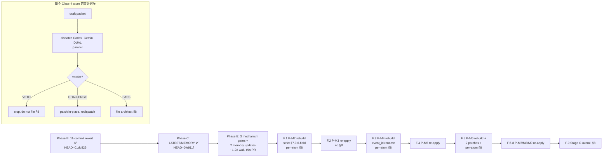

<!--
  Archive header — added 2026-05-09 session #28 per Codex re-audit Recommendation 3
  + plan §H + `feedback_kolmogorov_compression` lossless-archive rule.
  ===================================================================
  Source           : architect-approved ultraplan, 2026-05-09 session #28.
  Approval         : User verbatim "plan批准：..." preceded the plan body
                     (a verbatim multi-clause approval per CLAUDE.md §4.3
                     analogous to "好，确认可以 ship" form).
  Status           : ARCHIVED — operative plan for Phase E + Phase F (Stage C
                     post-VETO rebuild).
  Supersedes       : `cozy-waddling-raven.md` (rolled back 2026-05-09 per
                     Stage C VETO directive
                     `handover/directives/2026-05-09_STAGE_C_POLYMARKET_PM2_PM4_PM6_BATCH_§8_VETO.md`).
  Layer-1 impact   : None.
                     - kernel.rs zero-domain-knowledge: unchanged
                     - Append-Only DAG: unchanged
                     - Economic conservation: strengthened via E.3 source
                       refactor (assert_complete_set_balanced symmetric/asymmetric
                       branch split) + E.3 strict-equality lint gate.
                     - Constitution clauses: no new clauses; reaffirms
                       FC1/FC3 + Art. III + §13 economy law + §14 predicate.
  Operating-mode   : Constitutional Harness Engineering (CLAUDE.md §2 PRIME).
  Companion records: live at `~/.claude/plans/cached-noodle.md` (user host)
                     and (Codex re-audit Recommendation 3) here.
  Memory rule      : Future architect-approved ultraplans must be archived
                     in-repo at `handover/architect-insights/` per this
                     precedent + `feedback_kolmogorov_compression`.
  ===================================================================
-->

# Stage C Polymarket — Post-VETO Replan (cached-noodle)

> Replaces / supersedes the rolled-back plan `cozy-waddling-raven.md`.
> Authority: `2026-05-09_STAGE_C_POLYMARKET_VETO_REMEDIATION_DIRECTIVE.md`
> Current HEAD: `0fe911f` (post-rollback; LATEST.md updated). Pre-Stage-C semantic baseline = `b468140`. Workspace tests **1308 / 0 / 151**, constitution gates **175 / 0 / 1** (verified post-rollback).

---

## §A. Context — 为什么这次造成了重大回滚

回滚的根因不是单一 bug，而是 **审计时序 + 节奏选择 + 缺失机制** 三层叠加。Codex G2 一次审计发现 4 个缺陷，其中 P-M6 两个 load-bearing — 本质上是宪法守门员被旁路了。

### 4 个缺陷 (Codex 审计)

| # | Atom | 严重度 | 位置 | 问题 |
|---|------|--------|------|------|
| 1 | P-M6 | **load-bearing** | `src/economy/monetary_invariant.rs:516` | `assert_complete_set_balanced` 在 P-M6 扩展 `cpmm_pools_t` 进入 Σ_yes/Σ_no 时，沿用了既有的 `min(sum_yes, sum_no) == collateral` 写法。`min()` 容许 sum_yes ≠ sum_no 通过 — 直接违反 CLAUDE.md §13 "1 Coin = 1 YES + 1 NO" 与 architect §6.1 CTF invariant。CPMM swap 中池 YES/NO 永久分歧；ghost liquidity 边界被打开。 |
| 2 | P-M6 | **load-bearing** | `tests/constitution_router_buy_with_coin.rs:532` `router_atomic_rollback_on_failure` | 测试名 verbatim 正确，但 body 触发的是 **insufficient-balance**，被 `src/state/sequencer.rs:2469` 在 `q_next` 突变之前 (`:2514`) 直接拒绝。9-step 复合事务的原子回滚路径**根本没有被执行**。属于 vacuous test，没有 tape 证据证明原子性。 |
| 3 | P-M2 | verbatim drift | `src/state/typed_tx.rs:1417` | 多了 `timestamp_logical` 字段。Architect §7.3 verbatim 只规定 6 字段。该字段同时被签名 (`:1491`)，污染了 canonical signing payload。 |
| 4 | P-M4 | verbatim drift | `src/state/q_state.rs:694` | 用了 `event_id_kind`，architect §7.5 verbatim 是 `event_id`。打破了 Stage A2/A3 已建立的 verbatim-binding precedent。 |

### 节奏选择放大了爆炸半径 (CR-StageC-PM.16)

Charter §CR-StageC-PM.16 字面规定 **per-atom Class-4 §8 sign-off**。原计划为换取 ~3-4 周墙钟时间，**显式偏离** charter 走 batch §8 (P-M2+P-M4+P-M6 一并打包)。User 在 plan-mode 接受了这个偏离风险。

→ 任一 atom 在 batch 中被 VETO，cascade 会拖垮整批；P-M3/P-M5/P-M7/P-M8/P-M9 同时 runtime-depend on P-M2/P-M4/P-M6，连带回滚。最终 11 个 commit 全部 revert。

### 审计时序错位 (`feedback_dual_audit` 应用偏差)

原计划把 Codex/Gemini 双审放在 `Step 9` (batch §8 packet 草拟之后)，结果是**事后审计**：
- 缺陷已经进入 main，已经 push 到 origin。
- 审计 VETO 触发 11-commit revert + 12 commits 历史污染 (revert is additive)。
- 净成本：1d 实现 + 1d 审计 + 后续 ~3-4w 重建 ≫ 节省的 3-4w batch 收益 → **net negative**。

### 自审失效 — Class-4 必须双审

我自审结束认为 212 GREEN，gates GREEN，workspace tests GREEN。**4 个缺陷中没有一个被自审捕获**：
- 缺陷 1：`min()` 是 pre-Stage-C 既有写法，自审视为 "不变量保留"，没意识到 CPMM 池 reserves 进入 sums 后 `min()` 语义彻底变了。
- 缺陷 2：测试 GREEN，名字对，自审用名字-命中校验，没看 body 路径。
- 缺陷 3/4：verbatim 字段对照需要把 architect manual 与 struct 字段集合并集对比 — 自审没有这个机制。

→ 验证了 `feedback_dual_audit` Class-4 = full dual 的必要性，验证了 `feedback_audit_after_evidence` 必须**前置**到 packet draft 时刻 (而不是 packet 提交后)。

### 一个隐藏遗留 — `min()` 在 HEAD `0fe911f` 仍然存在

回滚把 P-M6 的 cpmm_pools_t 扩展撤掉了，但 `assert_complete_set_balanced` 在 line 485 依然是 `let min_side = sum_yes.min(sum_no);`。这是 TB-13 既有写法，**predates Stage C**。Codex 审计指出的弱化在 Stage C 上下文中是 load-bearing；在 pre-Stage-C 上下文中也是隐患 (post-resolution edge case 用 min() 兜底，逻辑上 fragile)。Phase E.3 strict-equality 闸必须在设计时处理这个既有 case，不能留下"机制有了但绕过既有写法"的口子。

---

## §B. 总体方针 — Phase B (rollback) ✅, Phase C (state docs) ✅, 接下来 Phase E + Phase F



**本 PR 范围 = Phase E only**。Phase F 留给后续 session（每个 Class-4 atom 走自己的 PR + 自己的审计 + 自己的 §8 sign-off）。

---

## §C. Phase E 实施细节 — 3 个 mechanism gate + 2 memory 更新

### E.1 — verbatim spec binding gate (新文件)

**文件**: `tests/constitution_architect_verbatim_struct_binding.rs` (NEW)

**目的**: 机械对比 architect manual §7.x 中 `pub struct` 块的字段集合 vs 当前 codebase 实现的字段集合。**严格相等**：架构师没说的字段不能加，架构师说了的字段不能少，字段名不能改。

**实现思路** (参考 `tests/constitution_market_quarantine.rs` grep-style 模式):
- 常量数组 `VERBATIM_BINDINGS: &[StructBinding]`，每个条目：
  ```rust
  StructBinding {
      manual_path: "handover/architect-insights/2026-05-07_ARCHITECT_ALIGNMENT_AUDIT_LAUNCH_POLYMARKET_MANUAL_en.md",
      manual_section: "§7.3",         // 目前没有 struct landed (rolled back); test stub
      struct_name: "CompleteSetMergeTx",
      impl_path:    "src/state/typed_tx.rs",
      // expected fields parsed from manual ¶ enclosing `pub struct CompleteSetMergeTx {`
  }
  ```
- 解析 manual：在 `manual_path` 里找 ```` ```rust ```` 后跟 `pub struct <name>` 块，提取所有 `pub <field>: <type>` 行，收集字段名集合 `expected`。
- 解析 impl：在 `impl_path` 里找同名 struct 块（直到第一个 `}`），收集字段名集合 `actual`。
- 断言 `expected == actual`（HashSet 严格相等，diff 可读输出）。
- 字段顺序不强制，但**字段集合必须严格相等**。
- 当前 manifest 中 P-M2/P-M4/P-M6 struct 已 revert → impl 中找不到 → test mode = "manual 中的 struct 必须在 impl 中存在 OR 标记为 NotYetLanded"。设计：每个 binding 多带一个 `landing_status: Landed | NotYetLanded` 字段，`NotYetLanded` 时 test pass，`Landed` 时强制相等。Phase F.1/F.3/F.5 各自把对应 binding 改为 `Landed`。
- 同时为 **已 landed 的 architect-spec'd struct** (e.g. `CompleteSetMintTx` from §7.2) 加正向 binding，证明 gate 在 GREEN baseline 工作。
- 失败信息必须 actionable：`P-M2: implementation has extra field {timestamp_logical}; manual §7.3 spec is exactly {tx_id, parent_state_root, event_id, owner, amount, signature}`。

**Self-check**: 增加一个 fixture 测试，喂入合成 manual + 合成有 drift 的 struct，断言 gate 抛出。（参考 `feedback_no_workarounds_strict_constitution` — gate 必须能 fail。）

### E.2 — atomic rollback witness gate (新文件)

**文件**: `tests/constitution_class4_atomic_rollback_witness.rs` (NEW)

**目的**: 强制每个 Class-4 复合事务的 `*_atomic_rollback_on_failure` 测试**实际穿透 `q_next` 突变阶段**，而不是被前置校验拦在外面。

**实现思路** (静态 + 动态混合):
- 常量数组 `COMPOSITE_TX_ROLLBACK_BINDINGS`，每条目登记：
  ```rust
  CompositeTxRollback {
      composite_name: "BuyWithCoinRouter",
      atom_id: "P-M6",
      rollback_test_path: "tests/constitution_router_buy_with_coin.rs",
      rollback_test_fn: "router_atomic_rollback_on_failure",
      landing_status: Landed | NotYetLanded,
      required_failure_phase: AfterMutationStarted, // 而不是 BeforeMutation
  }
  ```
- 静态层：源码扫 `rollback_test_path`，找到 fn body，断言体内必须**调用** `inject_failure_after_step(N)` 或类似 well-defined helper（这个 helper 是 sequencer 中新增的 test-only 失败注入点）。否则抛出。
- 动态层：在 `src/state/sequencer.rs` 中加一个 cfg(test) 的 `inject_failure_at_step` 接口，让 P-M6 test 能在 step 5/6/7 (mid-mutation) 触发 panic-equivalent，witness `q_next` 已被局部突变，然后 catch + 断言 `q.state_root == parent.state_root` 完全恢复。
- gate 同时检测**反例**：fixture 测试一个故意写得 vacuous 的 rollback test（前置校验直接拒），断言 gate 抛出。
- 当前没有 P-M6 落地 → `landing_status = NotYetLanded`，gate pass。Phase F.5 把 P-M6 重建后改为 `Landed`，并附带 mid-mutation 失败注入点的 test。

**关键**: 这个 gate 设计要把 sequencer 的失败注入接口作为 "Phase F.5 必须实现" 的一部分写入 directive。本 PR (Phase E) 只放静态扫描 + landing_status=NotYetLanded 的占位。

### E.3 — strict-equality invariant lint (新文件)

**文件**: `tests/constitution_economy_strict_equality.rs` (NEW)

**目的**: grep 守住 conservation invariants 的等式形式，禁止用 `min(sum_yes, sum_no) == collateral` 这种弱化写法。

**实现思路** (参考 `constitution_market_quarantine.rs` 的 line-scan):
- 常量 `CONSERVATION_INVARIANT_FILES = &["src/economy/monetary_invariant.rs"]`。
- 对每个文件做 line scan：
  - 匹配 pattern A `\.min\(.*sum_(yes|no)` 或 `min\(sum_(yes|no)`：禁止。
  - 例外：函数级 `#[allow(turingos_strict_equality_pre_resolution)]` attribute 可豁免（仅用于 pre-resolution edge case，必须有 `// SAFETY: ...` 注释说明）。
- **本 gate 在 HEAD `0fe911f` 现状下会 FAIL** — 因为 `assert_complete_set_balanced:485` 仍然是 `let min_side = sum_yes.min(sum_no); if min_side != collateral_units`。所以 Phase E.3 必须**同时**修这段代码：
  - **修法**：把 `assert_complete_set_balanced` 拆成 pre-resolution 和 post-resolution 两条路径。
    - Pre-resolution 事件 (event 未 resolved)：strict `sum_yes == collateral && sum_no == collateral`。
    - Post-resolution 事件 (有 resolved_outcome)：只要求 winning-side `sum_winning >= residual_unredeemed_collateral`，losing side 不要求等于 collateral（losing shares 不再 backed by collateral，是 stranded shares 而非 ghost）。
  - 这条修复**本身就是 Stage C 必须做的清理**，原 P-M6 audit 已经把它定性为 load-bearing。在 Phase E 解决就避免 Phase F.5 撞同一堵墙。
- Self-check fixture：合成一个故意带 `min(sum_yes, sum_no)` 的临时文件，断言 gate 抛出。

**警告**: 修 `assert_complete_set_balanced` 触及 `src/economy/monetary_invariant.rs` — 该文件在 STEP_B 名单内 (CLAUDE.md §12)。但本次仅是 internal logic 重构 + 不改 schema、不改 signing payload、不改 sequencer admission，按 Class-2 production wire-up 走，不需要 §8 sign-off。**安全检查**：跑 `cargo test --workspace` 确认现有 TB-13 / P-M0 / P-M1 测试 (post-resolution 行为) 仍 GREEN。

### E.4 — feedback_no_batch_class4_signoff (新 memory file, 用户机器写)

**路径** (用户 host): `~/.claude/projects/-home-zephryj-projects-turingosv4/memory/feedback_no_batch_class4_signoff.md`

**内容**: hard rule — 任何 Class-4 atom 的 §8 sign-off 必须 per-atom，不允许 batch packet（无论墙钟压力）。引用 Stage C session #27 evidence 与 ~3-4 周净亏损。

**注意**：本远程 plan session 无法触及用户本机的 memory 路径。Phase E.4 由本 PR commit message + LATEST.md 更新提示用户在自己机器上 commit memory file，或在下次 cold start 时由 cold-start hook 触发提醒。**实现** = 在 LATEST.md "Open after Polymarket" 上方新增 "Pending memory writes (user host)" 节。

### E.5 — feedback_dual_audit timing 更新 (用户机器编辑)

**路径** (用户 host): `~/.claude/projects/-home-zephryj-projects-turingosv4/memory/feedback_dual_audit.md`

**内容增量**: 时序规则 — Codex + Gemini dispatch 必须发生在 **packet draft time** (architect §8 申请之前)，而不是 packet 提交后。理由：Stage C session #27 是反例 (审计 VETO 已打到 main 之后才到达，导致 12-commit revert 历史污染)。

**注意**：同 E.4，远程 session 不能触达用户机器；本 PR 只在 LATEST.md 备注 pending。

### E.6 — gate 注册 + 自审跑 + commit

**修改**: `scripts/run_constitution_gates.sh`
- `GATES=()` array 新增：
  - `constitution_architect_verbatim_struct_binding`
  - `constitution_class4_atomic_rollback_witness`
  - `constitution_economy_strict_equality`
- 当前 27 → 30。

**验证**:
- `cargo check --workspace` 干净。
- `cargo test --workspace --no-fail-fast` GREEN，count = 1308 + ~9 self-tests (3 gates × ~3 tests each) ≈ 1317。
- `bash scripts/run_constitution_gates.sh` 175 → ~178 GREEN / 0 / 1。
- `cargo test --lib verify_trust_root_passes_on_intact_repo` PASS（E.3 修了 `monetary_invariant.rs` → trust_root 需 rehash；同 commit 一起更新 `genesis_payload.toml [trust_root]`）。

**FC-trace trailer** 必须带，per `feedback_chaintape_externalized_proposal`。

---

## §D. Phase F 执行规则（本 PR 之外，每个 atom 一个 PR）

每个 Class-4 atom (F.1 P-M2 / F.3 P-M4 / F.5 P-M6) 走相同模板：

1. **重写实现** 严格按 architect manual §7.x verbatim：字段集合、字段名、字段顺序匹配。
2. **写测试** verbatim 命名匹配；P-M6 的 `router_atomic_rollback_on_failure` 必须穿透到 `q_next` mid-mutation 阶段才触发失败注入。
3. **跑 Phase E gates**：E.1 binding 必须 GREEN（landing_status 改为 `Landed`）；E.2 witness 必须 GREEN（P-M6 only：mid-mutation 失败注入实测）；E.3 strict-equality 必须 GREEN。
4. **STEP_B parallel-branch**：`feat/p-m{2,4,6}-rebuild` 分支，本 atom 内 cargo test 全 GREEN 后 `--no-ff` 合主线。Trust Root rehash routine 每 atom 一次。
5. **packet draft + DUAL audit PRE-§8** (新时序，per E.5 timing rule):
   - draft `handover/directives/YYYY-MM-DD_STAGE_C_POLYMARKET_PMx_§8_SIGN_OFF_PACKET.md`
   - Agent dispatch: Codex G2 audit + Gemini parallel dual audit
   - 等双审；conservative-wins (VETO > CHALLENGE > PASS)
   - VETO → patch → re-dispatch；3 round cap per `feedback_elon_mode_policy`
   - PASS → 提交 architect §8 verbatim 申请
6. **architect §8 verbatim sign-off** → ship
7. **下一个 atom 才能开始**

非 Class-4 atom (F.2 P-M3 / F.4 P-M5 / F.6 P-M7 / F.7 P-M8 / F.8 P-M9): 还是 per-atom commit + cargo test GREEN，但不需要 per-atom §8。可以连续 ship。

F.9 Stage C overall §8 packet：在所有 atom 完成后单独 packet + DUAL audit PRE-§8 + architect verbatim ratification。

---

## §E. 关键文件 (本 PR 触碰)

### 新增
- `tests/constitution_architect_verbatim_struct_binding.rs` (E.1)
- `tests/constitution_class4_atomic_rollback_witness.rs` (E.2)
- `tests/constitution_economy_strict_equality.rs` (E.3)

### 修改
- `src/economy/monetary_invariant.rs` (E.3 fix — 拆分 pre/post-resolution, 删除 `min()`, 新增 attribute helper if needed)
- `genesis_payload.toml` (Trust Root rehash for monetary_invariant.rs)
- `scripts/run_constitution_gates.sh` (E.6 注册 3 个新 gate)
- `handover/ai-direct/LATEST.md` (Phase E 完成记录 + Pending memory writes section + Phase F 节奏明确化)

### 不触碰（保留）
- `src/state/typed_tx.rs` — Phase F.1/F.5
- `src/state/sequencer.rs` — Phase F.1/F.5（除非 E.2 需要 cfg(test) 失败注入接口；如果是，最小化改动并写明 only test-cfg）
- `src/state/q_state.rs` — Phase F.3
- `src/runtime/*` — 全部 Phase F
- `handover/directives/*` — 已有 VETO + 重建 directive 不动
- `handover/tracer_bullets/STAGE_C_POLYMARKET_PM0_PM9_charter_2026-05-07.md` — 不动；charter 已经 revert 到 P-M0 only SHIPPED state；后续 atom 重建时由各自 §8 file 更新 SHIPPED label

---

## §F. 复用 (避免新增重复)

- `tests/constitution_market_quarantine.rs` — grep-style line scan + ALLOW_LIST + HARD_BANNED 模式：E.1/E.2/E.3 的扫描层完全照搬这个文件结构。
- `tests/constitution_completeset_hardening.rs` — verbatim 命名约束的实现模式（fn 名 1:1 对应 manual）：E.1 的解析逻辑可以参考它的 binding 风格。
- `tests/tb_13_legacy_cpmm_forward_fence.rs` — 合规绕过反例（Layer 1 + Layer 2 marker），但 E.x 走 `feedback_no_workarounds_strict_constitution` 的 simpler explicit allow-list 路径。
- `src/economy/monetary_invariant.rs::assert_complete_set_balanced` 的 pre-resolution / post-resolution 拆分，可参考 `assert_total_ctf_conserved` (line 395) 已有的"按 event 状态分类"模板。

---

## §G. 验证清单 (本 PR 完成判据)

| ID | 检查 | 通过判据 |
|---|---|---|
| V.1 | `cargo check --workspace` | 干净，0 新警告 |
| V.2 | `cargo test --workspace --no-fail-fast` | ≥1308 PASS（+ 新 gate 内嵌 self-tests），0 fail |
| V.3 | `bash scripts/run_constitution_gates.sh` | 30 GREEN / 0 / 1（175 + 3 gates × ~1 entry each = ~178 名义计数；按 gate 文件计 27→30） |
| V.4 | `cargo test --lib verify_trust_root_passes_on_intact_repo` | PASS（E.3 改后 genesis_payload.toml 已更新 hash） |
| V.5 | E.1 self-check fixture | 合成 drift struct → gate fail（证 gate 能 fail） |
| V.6 | E.2 self-check fixture | 合成 vacuous rollback test → gate fail |
| V.7 | E.3 self-check fixture | 合成 `min(sum_yes, sum_no)` → gate fail |
| V.8 | E.3 真实回归 | TB-13 / P-M0 / P-M1 既有 post-resolution 测试仍 GREEN（pre/post split 不退化既有行为） |
| V.9 | LATEST.md | 新增 "Phase E SHIPPED 2026-05-09" 节；新增 "Pending memory writes (user host)" 节列出 E.4/E.5 |
| V.10 | git log | 单 commit (或必要时按文件分 2-3 个原子 commit)；FC-trace trailer 完整 |

---

## §H. 失败模式 + 退路

| 失败 | 退路 |
|------|------|
| E.3 修 `assert_complete_set_balanced` 后 TB-13 既有测试 RED | E.3 改为 lint-only（不修 source），代价：本 gate 在 HEAD 立刻 FAIL；通过给该函数加 `#[allow(turingos_strict_equality_pre_resolution)]` 形式的 attribute + 注释写明"待 Phase F.5 一并整治"豁免它，gate 在 Phase E PASS。**这是 fallback，不是首选** — 首选是直接修。 |
| E.1 manual 解析偏脆弱（regex 匹配 ` ```rust ` 块） | 把字段集合作为 hardcoded fixture（在 test 文件内嵌入 architect §7.3/§7.5/§7.7 verbatim），对比 codebase struct 而非 parse manual。代价：manual 改时 fixture 需手动同步（charter `feedback_no_workarounds_strict_constitution` 容许这种"显式同步点"）。 |
| E.2 sequencer cfg(test) 失败注入接口超出 STEP_B 安全边界 | 本 PR 只放 E.2 静态层（grep 检查测试 body 是否调用了某个标记函数名）；动态注入接口推到 Phase F.5，由 P-M6 重建 packet 一起 STEP_B。 |
| 任何 gate 在 baseline 失败 (V.3 != 30 GREEN) | HALT，不 commit，回查 — 前置 baseline 已是 175 GREEN，新 gate 不能让它退化。 |

---

## §I. 不在本 PR 范围（明示 forward）

- Phase F 任何 atom 的实现 — 各自走自己的 PR + audit + §8。
- E.4 / E.5 用户机器 memory 文件写入 — 本 PR 在 LATEST.md 留 "Pending memory writes (user host)" 备忘，由用户在本机 cold start 时按指引补齐。
- "Open after Polymarket" 块（C.5 PromptCapsule wire-up / B.4 CAS Merkle redesign / J.2 J.3 J.5 / K.1-6）— 全部继续 forward，不动。
- `assert_complete_set_balanced` 在 P-M4 CPMM-pool extension 下的最终行为 — Phase F.3 + F.5 重建时再收敛（pool reserves 进入 sums 是 P-M4/P-M6 的事）。本 PR 只确保 strict equality 在 baseline 不被 `min()` 弱化。

---

## §J. 与原计划 (cozy-waddling-raven) 的差异速览

| 维度 | 原计划 | 本计划 |
|------|--------|--------|
| §8 节奏 | batch (P-M2+P-M4+P-M6 一并) | strict per-atom |
| 审计时序 | post-§8 (打包后) | pre-§8 (packet draft 即触发 DUAL) |
| 机制守门员 | 无（依赖自审） | E.1 verbatim binding + E.2 atomic rollback witness + E.3 strict equality |
| Phase E 是否前置 | 无 Phase E 概念 | 强制前置（Phase F 任何 atom 之前都必须先 ship Phase E） |
| `min()` 既有问题 | 未识别（被 P-M6 propagate 后才被审计抓到） | E.3 在重建之前先在 baseline 修掉 |
| memory rule 编码 | 无 | E.4 + E.5 显式编码 (no-batch-class4-signoff + dual-audit-PRE-§8) |
| 墙钟预期 | ~1d 实现，结果 ~3-4w 重建 → net negative | Phase E ~1-2d + Phase F ~3-4w，预期 net = strict per-atom 全程 ~3-4w |

净效果：把"用墙钟换风险"的赌局换成"先建机制再机械执行"，Codex/Gemini 双审从事后追责机制变成 packet 守门员。
