# Sprint Dependency Graph v1

> **Date**: 2026-04-27
> **Purpose**: Plan v3.2-fix1 § 5 punted on full atom-level dependency graph. Codex CO P0.7 §1 Plan VETO partially because of this. This doc closes that gap: every CO P0+P1+P2 atom has explicit `blocks` and `blockedBy` edges, plus a critical-path identification.
> **Authority**: Plan v3.2-fix1 atom list.
> **Status**: v4 deliverable; sprint launches consult this doc; updated on any plan amendment.

---

## § 1 Reading Guide

- **Atom IDs** match Plan v3.2-fix1 (e.g., `CO1.1.4` from § 3 of plan)
- **Blocks** = "this atom must finish before X starts"
- **BlockedBy** = "this atom needs X to finish first"
- **Parallelism** = atoms with same level of dependency depth can run concurrently

Format: Each atom has `[ID] Title  →  blocks: [...]  blockedBy: [...]  est: <time>  STEP_B?`

---

## § 2 CO Phase 0 (Foundation)

### 2.1 Already complete (post-ratification 2026-04-27)

```
[CO0.1] FINAL_BLUEPRINT shipped              ✓ committed 2c3fd84
[CO0.2] CO_MEGA_PLAN_v3.1 shipped            ✓ committed 2c3fd84
[CO0.3] Constitution Art 0.5 DRAFT           ✓ DRAFT only (committed); enactment is independent ceremony
[CO0.4] PREREG_AMENDMENT_v2 DRAFT            ✓ DRAFT only
[CO0.5] TFR v1 deprecate banner              ✓ committed
[CO0.6] TR manifest 43→65 entries            ✓ committed (multiple iterations)
[CO0.7] Codex+Gemini dual audit              ✓ both rounds done
[CO0.7'] TR governance hook                   ✓ scripts/check_tr_ratification_chain.sh
[CO0.8] TRACE_MATRIX_v3 N/M/D                ✓ handover/alignment/TRACE_MATRIX_v3_2026-04-27.md
[CO0.9] META_TX_SCHEMA                        ✓ handover/specs/META_TX_SCHEMA_v1_2026-04-27.md
[CO P3-prep.4] AmendmentFlow format           ✓ handover/specs/AMENDMENT_FLOW_FORMAT_v1
[CO P3-prep.5] MetaTransitionInterface trait  ✓ handover/specs/META_TRANSITION_INTERFACE_v1
[CO P3-prep.6] V4_1_METATAPE_PLAN             ✓ handover/architect-insights/V4_1_METATAPE_PLAN_v1
[CO1.SPEC.0.4] TLA+ skeleton (OPTIONAL)       ✓ handover/specs/STATE_TRANSITION_SPEC_TLA_2026-04-27.tla
[CO1.3.1 prep] gix spike pre-flight           ✓ handover/specs/CO1_3_1_GIX_SPIKE_PREFLIGHT_v1
```

### 2.2 Pending (require ceremony)

```
[CO0.3-enact] Constitution Art 0.5 cp-workflow + signed tag    USER ACTION; not blocking CO P1
[CO0.4-enact] PREREG_AMENDMENT_v2 enactment                    USER ACTION; not blocking CO P1
[CO0.7'-action] User signs new ratification tag for c6dd122 + ae11491  USER ACTION
```

CO P0 is **functionally complete** for CO P1 entry. Outstanding ceremonies are async; CO P1 sprint can launch.

---

## § 3 CO Phase 1 (GitTape + Anti-Oreo + Predicate/Tool Registries)

### 3.1 Critical Path

```
[CO1.SPEC.0]  STATE_TRANSITION_SPEC freeze + dual audit
    └─ STATE_TRANSITION_SPEC v1 already shipped; remaining: Codex+Gemini final spec sign-off (1-2 days)
[CO1.3.1]     gix substrate spike (5-day time-box)         ← FIRST atom
    └─ blocks: CO1.3.2, CO1.4
[CO1.3.2]     runtime_repo per-cell init in evaluator
    └─ blocks: anything that needs git operations
[CO1.0]       Constitution Root + Genesis (4 atoms)
    └─ blocks: CO1.5 (predicate registry needs genesis amendment_predicate to anchor)
    └─ blocks: CO1.6 (tool registry similarly)
[CO1.1.1]     Skeleton dirs (4 root dirs + economy + state + transition + governance)
    └─ blocks: every CO1.X module placement
[CO1.1.2]     wal/ledger move (STEP_B; 1 d)
    └─ blocks: CO1.7 (transition ledger)
[CO1.1.3]     sandbox move (1 d)
    └─ blocks: nothing critical
[CO1.1.4-pre1] Kill completion_tokens=0 literal (STEP_B; half d)
    └─ blocks: CO1.1.4 (don't preserve rot through file moves)
[CO1.5]       Predicate Registry + Visibility (8 atoms)
    └─ blockedBy: CO1.0 (genesis amendment_predicate)
    └─ blocks: CO1.7 stage 4 (predicate gate)
    └─ blocks: CO P2.5 (challenge predicate is a settlement predicate)
[CO1.6]       Tool Registry (5 atoms)
    └─ blockedBy: CO1.0
    └─ blocks: CO1.7 stage 4 (TuringTool migration)
[CO1.7]       Transition Ledger + Retry Metadata + System Keypair (9 atoms incl 0a-f)
    └─ blockedBy: CO1.1.2, CO1.5, CO1.6
    └─ blocks: every CO1.7-1.9 implementation atom
[CO1.7.0a]    SYSTEM_KEYPAIR_SECURITY_v1 spec freeze       ✓ already shipped
[CO1.7.0b-f]  System keypair impl (5 atoms; STEP_B-adjacent)
    └─ blockedBy: CO1.7.0a (spec already shipped)
    └─ blocks: CO1.7 retry metadata signing
[CO1.4]       CAS layer (4 atoms)
    └─ blockedBy: CO1.3.1, CO1.5 (visibility schema)
    └─ blocks: CO1.7 (transition references CAS for proposal_cid)
[CO1.1.4]     bus.rs split (5-way; STEP_B parallel branches against spec; 1.5 wk)
    └─ blockedBy: CO1.1.4-pre1 + CO1.1.1 + CO1.SPEC.0 (spec frozen)
    └─ blocks: CO1.8 (materializer)
[CO1.1.5]     kernel.rs split (3-way; STEP_B parallel; 1.5 wk)
    └─ blockedBy: CO1.1.4 (bus split must finish first; their interfaces interact)
    └─ blocks: CO1.7.5 (step_transition fn implementation)
[CO1.1.6]     layer-leak conformance test
    └─ blockedBy: CO1.1.4, CO1.1.5
    └─ blocks: nothing
[CO1.2]       Q_t struct (3 atoms)
    └─ blockedBy: CO1.1.5 (kernel split provides typed home)
    └─ blocks: CO1.7.5 (step_transition uses QState)
[CO1.7.5]     step_transition fn impl (THE main transition fn)
    └─ blockedBy: CO1.7.1 (TransitionTx schema), CO1.5, CO1.6, CO1.4, CO1.2, CO1.7.0c (sign API)
    └─ blocks: CO1.8, CO1.9, all CO P2
[CO1.8]       Materialized State (8 atoms)
    └─ blockedBy: CO1.7
    └─ blocks: CO1.9 (signal indices need materialized view)
[CO1.9]       Signal Indices (7 atoms)
    └─ blockedBy: CO1.8
    └─ blocks: CO1.10 (boolean vs statistical signals)
[CO1.9.5]     derive_l6_from_tape (failure histogram)
    └─ blockedBy: CO1.7 (retry metadata schema)
    └─ blocks: CO1.9.6 conformance test
[CO1.9.6]     L6 reconstructibility test
    └─ blockedBy: CO1.9.5 + CO1.7
    └─ blocks: CO1.14 exit
[CO1.10]      Signal dichotomy (3 atoms)
    └─ blockedBy: CO1.9
    └─ blocks: CO1.11
[CO1.11]      Safety vs Creation fail policy (2 atoms)
    └─ blockedBy: CO1.10, CO1.5
    └─ blocks: CO1.14 exit
[CO1.12]      V01-V24 + E01-E04 closure (covered by P1.5-P1.9)
    └─ continuous; no separate atom
[CO1.13]      TRACE_MATRIX_v3 implementation (3 atoms incl R-022 hook)
    └─ blockedBy: enough atoms shipped to start populating reverse-map § F
    └─ blocks: CO1.14 exit (fully populated trace matrix)
[CO1.14]      P1 exit dual audit
    └─ blockedBy: ALL CO1.* atoms
```

### 3.2 Parallelism Opportunities (CO P1)

Atoms that can run **concurrently** (different developers / different sessions):

```
PARALLEL GROUP A (after CO1.SPEC.0 freeze + CO1.1.1 skeleton):
  [CO1.3.1] gix spike            ⊥
  [CO1.0]   Genesis              ⊥        (4-5 day each; can start same day)
  [CO1.5-prep] PredicateRegistry types (no impl yet, just types)

PARALLEL GROUP B (after CO1.4 CAS, CO1.5/1.6 registries):
  [CO1.7.0b-f] System keypair atoms (independent of TransitionTx schema)
  [CO1.7.1]    TransitionTx schema (12-field)
  [CO1.7.4]    EventType migration (existing → TransitionTx subtype)

PARALLEL GROUP C (after CO1.7.5 step_transition):
  [CO1.8.*]   Materializer 8 atoms (each is an independent index)
  [CO1.9.*]   Signal Indices 7 atoms
  [CO1.10]    Signal dichotomy
  [CO1.11]    Safety/Creation policy

PARALLEL GROUP D (independent of main path):
  [CO1.1.6]   Layer-leak conformance (after 1.1.4 + 1.1.5)
  [CO1.13]    TRACE_MATRIX implementation (continuous)
```

### 3.3 Blocking Sequence (CO P1)

```
START
  ↓
[CO1.SPEC.0 spec freeze] ← currently STATE_TRANSITION_SPEC_v1 awaiting Codex+Gemini final sign-off
  ↓
[CO1.3.1 gix spike] (5d time-boxed; FIRST P1 atom)
  ↓
[CO1.1.1 skeleton dirs] (1d)
  ↓
[CO1.0 genesis] (1 wk)
  ↓
[CO1.1.4-pre1 kill completion_tokens=0] (half d, STEP_B)
  ↓
[CO1.5 + CO1.6 + CO1.4 + CO1.7.0b-f] (parallel; ~2-3 wk; STEP_B for CO1.4 + CO1.7.0)
  ↓
[CO1.1.4 bus split] (1.5 wk, STEP_B)
  ↓
[CO1.1.5 kernel split] (1.5 wk, STEP_B)
  ↓
[CO1.2 Q_t struct] (3-4 d)
  ↓
[CO1.7.5 step_transition impl] (1 wk, STEP_B)
  ↓
[CO1.8 materializer + CO1.9 signal index + CO1.10 + CO1.11] (parallel; ~3 wk)
  ↓
[CO1.13 TRACE_MATRIX impl] (1 wk; can start earlier in parallel)
  ↓
[CO1.14 exit dual audit]
END P1
```

**Critical path** (sequential): SPEC.0 → 1.3.1 → 1.1.1 → 1.0 → 1.1.4-pre1 → 1.1.4 → 1.1.5 → 1.2 → 1.7.5 → 1.14
≈ 10-12 weeks worst case; 8-10 weeks if parallel groups land smoothly.

---

## § 4 CO Phase 2 (RSP Economy)

### 4.1 Critical Path

```
[CO P2.0a]    i64 micro-coin money type (3-5 d)              ← FIRST P2 atom; BLOCKING for everything
    └─ blocks: every CO P2 economy atom
[CO P2.0]     Inv 4 precondition (1 d)
    └─ blockedBy: CO P2.0a
    └─ blocks: CO P2.2 (escrow uses MoneyType)
[CO P2.1]     TaskMarket (4 atoms; ~1 wk)
    └─ blockedBy: CO P2.0a, CO1.9 (price broadcast)
    └─ blocks: CO P2.3 (work_tx links to TaskMarket via task_id)
[CO P2.2]     EscrowVault (3 atoms; ~3-5 d)
    └─ blockedBy: CO P2.0a (money type)
    └─ blocks: CO P2.6 (settlement debits escrow)
[CO P2.3]     ContributionLedger (5-6 atoms; ~1 wk)
    └─ blockedBy: CO1.7.5 (transition fn), CO P2.1, CO P2.2
    └─ blocks: CO P2.4 (DAG built from work_tx read/write sets)
[CO P2.4.0]   Inv 8 DAG determinism SPIKE (BLOCKING; ~3-5 d)
    └─ blockedBy: CO P2.3 schema
    └─ blocks: CO P2.4.1+ (no implementation until algorithm spec PASSes audit)
[CO P2.4]     AttributionEngine (5-7 atoms; ~1.5 wk)
    └─ blockedBy: CO P2.4.0
    └─ blocks: CO P2.6 (reward formula uses attribution)
[CO P2.5]     ChallengeCourt (4-5 atoms; ~1 wk)
    └─ blockedBy: CO P2.3, CO1.5 (counterexample predicate is a settlement predicate)
    └─ blocks: CO P2.6 (reward formula uses survival)
[CO P2.6]     SettlementEngine + 3-layer rewards (4-5 atoms; ~1 wk)
    └─ blockedBy: CO P2.2, CO P2.4, CO P2.5
    └─ blocks: CO P2.11 (deployment)
[CO P2.7]     5 Agent roles (5-6 atoms; ~1 wk)
    └─ blockedBy: CO P2.3 (work_tx + verify_tx + challenge_tx schemas)
    └─ blocks: CO P2.11 (deployment uses agents)
[CO P2.8]     CTF stake symmetry (3 atoms; ~3-5 d)
    └─ blockedBy: CO P2.3
    └─ parallel with CO P2.4-2.5
[CO P2.9]     ReputationIndex (2-3 atoms; ~3 d)
    └─ blockedBy: CO P2.3
    └─ parallel with CO P2.4
[CO P2.10]    E-01 to E-04 closures (4 atoms; ~3-5 d)
    └─ blockedBy: CO P2.0 (post-init mint disabled)
    └─ parallel with CO P2.5+
[CO P2.11]    RSP MVP-1 deployment (2 atoms; ~3 d)
    └─ blockedBy: CO P2.6 + CO P2.7 + CO P2.4
    └─ blocks: CO P2.12 exit
[CO P2.12]    P2 exit dual audit
    └─ blockedBy: ALL CO P2.* atoms
```

### 4.2 Parallelism Opportunities (CO P2)

```
PARALLEL GROUP A (after CO P2.0a money type):
  [CO P2.1]   TaskMarket
  [CO P2.2]   EscrowVault
  [CO P2.0]   Inv 4 precondition

PARALLEL GROUP B (after CO P2.3 ContributionLedger):
  [CO P2.4]   AttributionEngine (CO P2.4.0 BLOCKS CO P2.4.1+)
  [CO P2.5]   ChallengeCourt
  [CO P2.7]   Agent roles
  [CO P2.8]   CTF stake symmetry
  [CO P2.9]   ReputationIndex

PARALLEL GROUP C (after CO P2.6 SettlementEngine):
  [CO P2.10]  E-01 to E-04 closures
  [CO P2.11]  RSP MVP-1 deployment
  [CO P3-PREP.7] meta_validator conformance test
```

### 4.3 Blocking Sequence (CO P2)

```
START P2
  ↓
[CO P2.0a money type] (3-5 d)
  ↓
[CO P2.0 + CO P2.1 + CO P2.2] (parallel; ~1 wk)
  ↓
[CO P2.3 ContributionLedger] (~1 wk)
  ↓
[CO P2.4.0 DAG SPIKE] (3-5 d, BLOCKING)
  ↓
[CO P2.4 + CO P2.5 + CO P2.7 + CO P2.8 + CO P2.9] (parallel; ~1.5 wk)
  ↓
[CO P2.6 SettlementEngine] (1 wk)
  ↓
[CO P2.10 + CO P2.11] (parallel; ~3-5 d)
  ↓
[CO P2.12 exit]
END P2
```

**Critical path** (sequential): P2.0a → P2.3 → P2.4.0 → P2.4 → P2.6 → P2.11 → P2.12
≈ 6-7 weeks; 5-6 weeks with smooth parallel landings.

---

## § 5 CO P3-PREP Track (interleaved with P1+P2)

CO P3-PREP atoms are independent of mainline P1+P2 critical path; they piggyback on existing infrastructure:

```
[CO P3-prep.1] META_TX_SCHEMA      ✓ already shipped
[CO P3-prep.4] AmendmentFlow       ✓ already shipped
[CO P3-prep.5] MetaTransitionInterface ✓ already shipped
[CO P3-prep.6] V4_1_METATAPE_PLAN  ✓ already shipped
[CO P3-prep.2] MetaProposalDraft CAS  → blockedBy CO1.4 CAS layer
[CO P3-prep.3] meta_validator library  → blockedBy CO P2.6 settlement_engine + CO1.5 visibility
[CO P3-prep.7] meta_validator conformance test  → blockedBy CO P3-prep.3
```

3 atoms remaining; all reach completion before CO P2.12 exit.

---

## § 6 Mermaid Diagram (Critical Path)

```mermaid
graph TD
    %% CO P0 (complete)
    P0_DONE[CO P0 complete<br/>Spec freeze, drafts, ratified]:::done

    %% CO P1 critical path
    P1_SPEC[CO1.SPEC.0<br/>Spec freeze + dual audit]:::critical
    P1_GIX[CO1.3.1 gix spike<br/>5d time-box]:::critical
    P1_SKEL[CO1.1.1 skeleton]:::critical
    P1_GENESIS[CO1.0 genesis<br/>1 wk]:::critical
    P1_PRE1[CO1.1.4-pre1<br/>kill completion_tokens=0]:::critical
    P1_REGS[CO1.5 + 1.6 + 1.4 + 1.7.0<br/>parallel; ~2 wk]:::wide
    P1_BUS[CO1.1.4 bus split<br/>STEP_B 1.5 wk]:::critical
    P1_KERNEL[CO1.1.5 kernel split<br/>STEP_B 1.5 wk]:::critical
    P1_QSTATE[CO1.2 Q_t struct]:::critical
    P1_STEP[CO1.7.5 step_transition impl<br/>1 wk]:::critical
    P1_PARA[CO1.8 + 1.9 + 1.10 + 1.11<br/>parallel; ~3 wk]:::wide
    P1_TRACE[CO1.13 TRACE_MATRIX impl]:::wide
    P1_EXIT[CO1.14 P1 exit audit]:::gate

    %% CO P2 critical path
    P2_MONEY[CO P2.0a money type<br/>BLOCKING]:::critical
    P2_TASK[CO P2.0 + 2.1 + 2.2<br/>parallel; ~1 wk]:::wide
    P2_LEDGER[CO P2.3 ContributionLedger]:::critical
    P2_DAG_SPIKE[CO P2.4.0 DAG spike<br/>BLOCKING]:::critical
    P2_ECON[CO P2.4 + 2.5 + 2.7 + 2.8 + 2.9<br/>parallel; ~1.5 wk]:::wide
    P2_SETTLE[CO P2.6 SettlementEngine]:::critical
    P2_DEPLOY[CO P2.10 + 2.11<br/>parallel; ~3-5 d]:::wide
    P2_EXIT[CO P2.12 P2 exit audit]:::gate

    %% CO P3-PREP track (interleaved)
    P3_PREP_REM[CO P3-prep.2 + .3 + .7<br/>interleaved with P1+P2]:::interleave

    %% Edges
    P0_DONE --> P1_SPEC
    P1_SPEC --> P1_GIX
    P1_GIX --> P1_SKEL
    P1_SKEL --> P1_GENESIS
    P1_GENESIS --> P1_PRE1
    P1_PRE1 --> P1_REGS
    P1_REGS --> P1_BUS
    P1_BUS --> P1_KERNEL
    P1_KERNEL --> P1_QSTATE
    P1_QSTATE --> P1_STEP
    P1_STEP --> P1_PARA
    P1_PARA --> P1_TRACE
    P1_TRACE --> P1_EXIT
    P1_EXIT --> P2_MONEY
    P2_MONEY --> P2_TASK
    P2_TASK --> P2_LEDGER
    P2_LEDGER --> P2_DAG_SPIKE
    P2_DAG_SPIKE --> P2_ECON
    P2_ECON --> P2_SETTLE
    P2_SETTLE --> P2_DEPLOY
    P2_DEPLOY --> P2_EXIT

    P1_GIX -.-> P3_PREP_REM
    P2_SETTLE -.-> P3_PREP_REM

    classDef done fill:#a8e6a3,stroke:#000
    classDef critical fill:#ff9999,stroke:#000,stroke-width:2px
    classDef wide fill:#ffd699,stroke:#000
    classDef gate fill:#9999ff,stroke:#000,stroke-width:2px
    classDef interleave fill:#d9d9ff,stroke:#666,stroke-dasharray:5
```



---

## § 7 Total Wall-Clock Estimate

| Phase | Critical path (sequential) | With smooth parallelism |
|---|---|---|
| CO P0 | DONE (post-ratification) | DONE |
| CO P1 | ~10-12 wk | ~8-10 wk |
| CO P2 | ~6-7 wk | ~5-6 wk |
| CO P3-PREP | interleaved | interleaved (no extra wall clock) |
| **v4 total** | **~16-19 wk** | **~13-16 wk** |

Plan v3.2-fix1 § 4 estimated 22-27 weeks. This dependency graph suggests **13-19 wk** is achievable IF parallel groups land smoothly. The 22-27 wk estimate accounts for slippage / rework risk.

---

## § 8 Risk-Adjusted Critical Path

Probability of slippage by atom:

| Atom | Slip probability | Max slip | Mitigation |
|---|---|---|---|
| CO1.3.1 gix spike | medium | 3-5 d (failure → git2-rs pivot) | pre-flight pre-clarifies; fallback ready |
| CO1.0 genesis | low | 2-3 d (boot.rs extension complexity) | spec frozen |
| CO1.1.4 bus split | high | 1-2 wk (the most architecturally risky atom) | spec-first protocol; STEP_B + spec conformance |
| CO1.1.5 kernel split | high | 1-2 wk | same as 1.1.4 |
| CO1.7.5 step_transition impl | medium | 1 wk (5-function fn + invariants) | spec frozen |
| CO P2.0a money type | low | 1-2 d (~50 LOC change) | mechanical |
| CO P2.4.0 DAG spike | medium | 3-5 d (deterministic algorithm hard) | dedicated spike atom |
| CO P2.6 SettlementEngine | medium | 1 wk (formula complexity) | walk-through validates |
| CO1.14 / CO P2.12 exit | medium | 3-5 d each (audit feedback) | tri-model protocol minimizes audit-induced rework |

---

## § 9 Honest Acknowledgements

What this graph achieves:
- Closes Codex CO P0.7 §1 Plan VETO partial reason (no dependency graph)
- Identifies 12 atoms on critical path; ~30-40 with parallelism opportunity
- Risk-adjusts wall-clock to 13-19 wk realistic range

What this graph is honest about:
- Atom-level dep edges are best-effort; some second-order deps may emerge during implementation
- Parallelism estimates assume 1 active developer; with multiple developers, faster
- "Wall clock" assumes ~6-8 productive hours/day; full-time vs side-project changes this

What this graph does NOT do:
- Generate Gantt chart automatically (mermaid is mind-map; Gantt requires `gantt` syntax which mermaid supports but not used here)
- Track actual progress (separate doc / TODO / TaskList; AUDIT_LEDGER tracks audit cost only)
- Pre-decide which atoms are parallelized in practice (depends on developer availability)

— ArchitectAI, 2026-04-27
